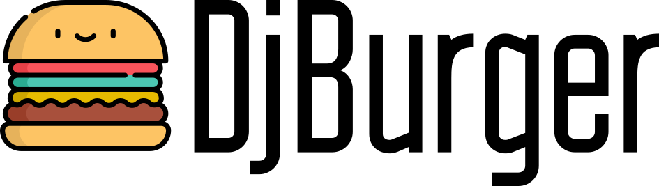
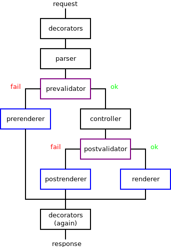

DjBurger
========

   DjBurger logo

|Build Status| |Documentation| |PyPI version| |Status| |Code size|
|License|

**DjBurger** -- framework for big Django projects.

What DjBurger do?

-  Split Django views into steps for secure and clean code.
-  Provide built-in objects for all steps.
-  Integrates this many side libraries like Django REST Framework and
   Marshmallow.

DjBurger doesn't depend on Django. You can use it in any projects if you
want.

Read more into
`documentation <https://djburger.readthedocs.io/en/latest/>`__.

Key principles
--------------

1. Validation logic is separate from the main logic.
2. Reusable logic for many views.
3. Reusable input and output data formats.
4. More clean views.

Dataflow
--------

1. **Decorators** (``d``). Feel free to use any side Django decorators
   like ``csrf_exempt``.
2. **Parser** (``p``). Parse request body.
3. **PreValidator** (``prev``). Validate and clear request.
4. **PreRenderer** (``prer``). Render and return PreValidation errors.
5. **Controller** (``c``). Main logic: do some things.
6. **PostValidator** (``postv``). Validate and clear response.
7. **PostRenderer** (``postr``). Render and return PostValidation
   errors.
8. **Renderer** (``r``). Render successful response.

   Scheme

Required only Controller and Renderer.

Explore
-------

1. Read `documentation <https://djburger.readthedocs.io/en/latest/>`__.
2. See `example <example/>`__ project.
3. For quick help just inspect djburger from python console (for
   example, ``help('djburger.views')``).
4. If you have some questions then `view
   issues <https://github.com/orsinium/djburger/issues>`__ or `create
   new <https://github.com/orsinium/djburger/issues/new>`__.
5. If you found some mistakes then fix it and `create Pull
   Request <https://github.com/orsinium/djburger/compare>`__.
   Contributors are welcome.
6. `Star this project on
   github <https://github.com/orsinium/djburger>`__ :)

.. |Build Status| image:: https://travis-ci.org/orsinium/djburger.svg?branch=master
   :target: https://travis-ci.org/orsinium/djburger
.. |Documentation| image:: https://readthedocs.org/projects/djburger/badge/
   :target: https://djburger.readthedocs.io/en/latest/
.. |PyPI version| image:: https://img.shields.io/pypi/v/djburger.svg
   :target: https://pypi.python.org/pypi/djburger
.. |Status| image:: https://img.shields.io/pypi/status/djburger.svg
   :target: https://pypi.python.org/pypi/djburger
.. |Code size| image:: https://img.shields.io/github/languages/code-size/orsinium/djburger.svg
   :target: https://github.com/orsinium/djburger
.. |License| image:: https://img.shields.io/pypi/l/djburger.svg
   :target: LICENSE
