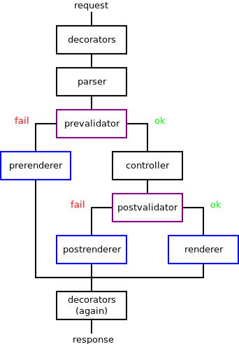

# Philosophy

## Key principles

1. Validation only before main logic.
2. Reusable logic for many views.
3. Reusable input and output data formats.
4. More clear views.

## Dataflow

1. **Decorators** (`d`). Feel free to use any side Django decorators like `csrf_exempt`.
2. **Parser** (`p`). Parse request body.
3. **PreValidator** (`prev`). Validate and clear request.
4. **PreRenderer** (`prer`). Render and return PreValidation errors.
5. **Controller** (`c`). Main logic: do some things.
6. **PostValidator** (`postv`). Validate and clear response.
7. **PostRenderer** (`postr`). Render and return PostValidation errors.
8. **Renderer** (`r`). Render successful response.

Required only Controller and Renderer.
